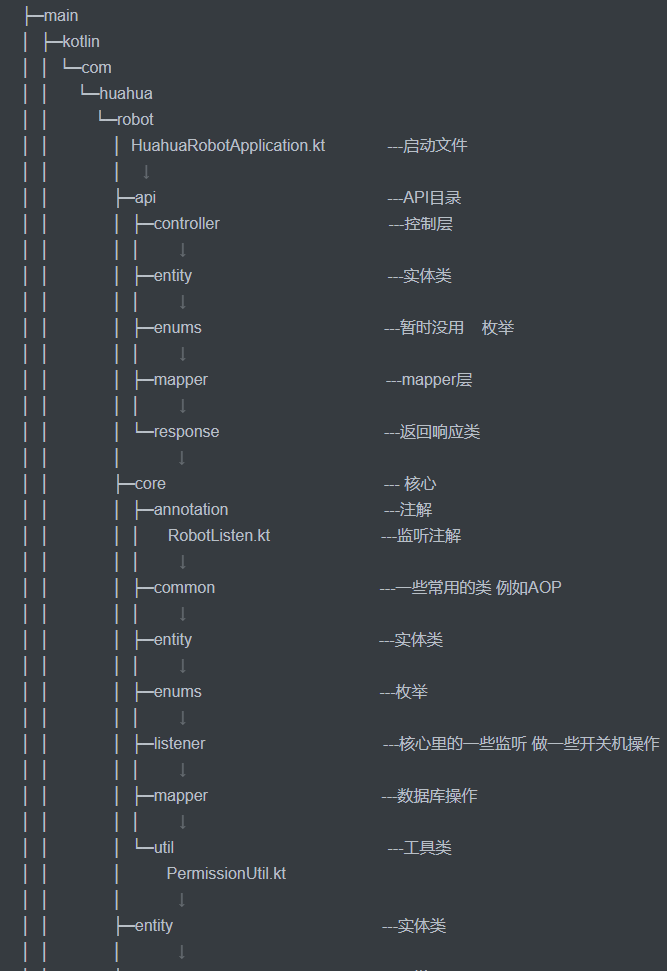
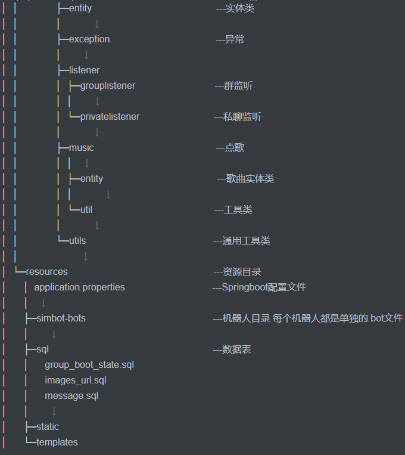

<div align="center">
    
    <p>
    	<h2>
        	花花的聊天机器人项目
    	</h2>
</div>

该项目为Springboot项目，此项目基于[simbot3](https://github.com/simple-robot/simbot-component-mirai)，实现了其中的mirai组件


## 项目文档

菜单地址：[3.x 功能菜单](https://www.yuque.com/qingsi-zwnmu/xyuvvi/wrbzgy)

内置WebApi: [api文档](https://console-docs.apipost.cn/preview/2994e3757e2103c4/f6807ee950c44a1e?target_id=f67ce078-7aa4-44a7-bfcb-9605bde46489#fb8ff78b-4e48-49e8-9c5c-00e25d7476d6)

## 项目地址

[GitHub](https://github.com/Chenyuxin221/huahua-robot)

## 运行环境

maven,java,mysql，kotlin

## 你需要掌握的知识

kotlin 基础，Springboot 常用注解

## 如何使用它

### 下载项目

安装了git可以直接执行`clone git@github.com:Chenyuxin221/huahua-robot.git`

或者可以去GitHub上下载压缩包，解压缩后导入到你idea

Idea可以直接克隆 具体教程自己去[百度](https://www.baidu.com) 篇幅太长

再不会的自己去[百度](https://www.baidu.com)

### 配置bot

在[simbot-bots](./src/main/resources/simbot-bots)目录下创建bot.bot文件

bot.bot

```json
{
    "component": "simbot.mirai",
  	"code": 123456789,
  	"passwordMD5": "bot的密码 使用md5加密",
  	"deviceInfoSeed": 1,
  	"workingDir": ".",
  	"heartbeatPeriodMillis": 60000,
  	"statHeartbeatPeriodMillis": 300000,
  	"heartbeatTimeoutMillis": 5000,
  	"heartbeatStrategy": "STAT_HB",
  	"reconnectionRetryTimes": 2147483647,
  	"autoReconnectOnForceOffline": false,
  	"protocol": "ANDROID_PHONE" 
}
```

### 配置数据库

在[resources](./src/main/resources/)目录下创建[application.properties]()文件

application.properties

```properties
simbot.core.keep-alive=true
spring.datasource.driver-class-name=com.mysql.cj.jdbc.Driver
spring.datasource.url=你的数据库地址
spring.datasource.username=用户名
spring.datasource.password=用户密码
```

#### 数据表结构

执行[sql](./src/main/resources/sql)目录下的*.sql文件

### 运行Bot	

运行[HuahuaRobotApplication.kt](./src/main/kotlin/com/huahua/robot/HuahuaRobotApplication.kt)文件

## 项目结构

)       


## 注意事项
- ### 无法登录提示环境异常 循环验证登不上去

​		请在手机上打开设备锁，再重新申请验证

- ### 不要在*.properties文件里加一些奇奇怪怪的配置项